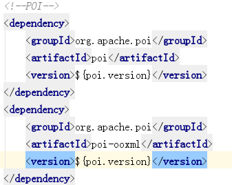
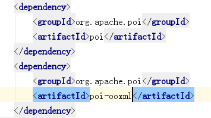
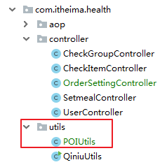
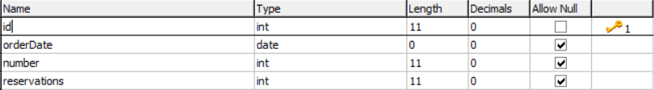
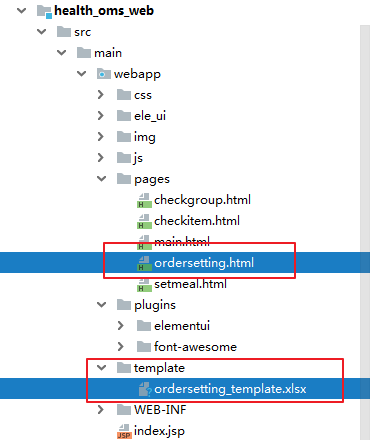
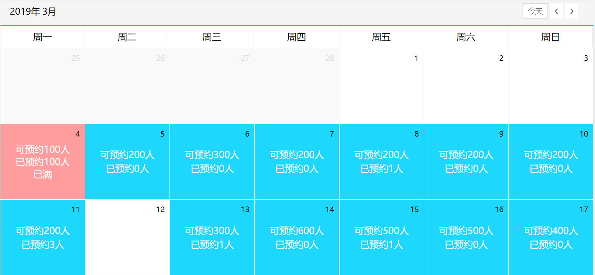
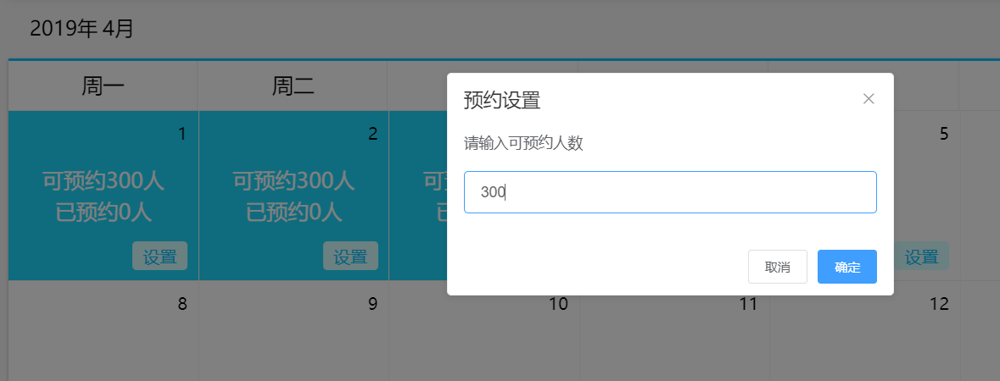

# 第5章 预约管理-预约设置

## 今日目标

1. 了解Apache POI
2. 掌握预约设置批量导入
3. 掌握预约设置信息日历展示
4. 掌握日历实现预约设置

## 1. 需求分析

前面我们已经完成了检查项管理、检查组管理、套餐管理等。接下来我们需要进行预约设置，其实就是设置每一天的体检预约最大数量。客户可以通过微信端在线预约，在线预约时需要选择体检的时间，如果客户选择的时间已经预约满则无法进行预约。

## 2. Apache POI

### 2.1 POI介绍

Apache POI是用Java编写的免费开源的跨平台的Java API，Apache POI提供API给Java程序对Microsoft Office格式档案读和写的功能，其中使用最多的就是使用POI操作Excel文件。

maven坐标：

~~~xml
<dependency>
  <groupId>org.apache.poi</groupId>
  <artifactId>poi</artifactId>
  <version>3.14</version>
</dependency>
<dependency>
  <groupId>org.apache.poi</groupId>
  <artifactId>poi-ooxml</artifactId>
  <version>3.14</version>
</dependency>
~~~

POI结构：

~~~xml
HSSF － 提供读写Microsoft Excel XLS格式档案的功能
XSSF － 提供读写Microsoft Excel OOXML XLSX格式档案的功能
HWPF － 提供读写Microsoft Word DOC格式档案的功能
HSLF － 提供读写Microsoft PowerPoint格式档案的功能
HDGF － 提供读Microsoft Visio格式档案的功能
HPBF － 提供读Microsoft Publisher格式档案的功能
HSMF － 提供读Microsoft Outlook格式档案的功能
~~~

### 2.2 POI API

#### 2.2.1 从Excel文件读取数据

使用POI可以从一个已经存在的Excel文件中读取数据

~~~java
//创建工作簿
XSSFWorkbook workbook = new XSSFWorkbook("D:\\hello.xlsx");
//获取工作表，既可以根据工作表的顺序获取，也可以根据工作表的名称获取
XSSFSheet sheet = workbook.getSheetAt(0);
//遍历工作表获得行对象
for (Row row : sheet) {
  //遍历行对象获取单元格对象
  for (Cell cell : row) {
    //获得单元格中的值
    String value = cell.getStringCellValue();
    System.out.println(value);
  }
}
workbook.close();
~~~

POI操作Excel表格封装了几个核心对象：

~~~p
XSSFWorkbook：工作簿
XSSFSheet：工作表
Row：行
Cell：单元格
~~~

上面案例是通过遍历工作表获得行，遍历行获得单元格，最终获取单元格中的值。

还有一种方式就是获取工作表最后一个行号，从而根据行号获得行对象，通过行获取最后一个单元格索引，从而根据单元格索引获取每行的一个单元格对象，代码如下：

~~~java
//创建工作簿
XSSFWorkbook workbook = new XSSFWorkbook("D:\\hello.xlsx");
//获取工作表，既可以根据工作表的顺序获取，也可以根据工作表的名称获取
XSSFSheet sheet = workbook.getSheetAt(0);
//获取当前工作表最后一行的行号，行号从0开始
int lastRowNum = sheet.getLastRowNum();
for(int i=0;i<=lastRowNum;i++){
  //根据行号获取行对象
  XSSFRow row = sheet.getRow(i);
  short lastCellNum = row.getLastCellNum();
  for(short j=0;j<lastCellNum;j++){
    String value = row.getCell(j).getStringCellValue();
    System.out.println(value);
  }
}
workbook.close();
~~~

#### 2.2.2 向Excel文件写入数据

使用POI可以在内存中创建一个Excel文件并将数据写入到这个文件，最后通过输出流将内存中的Excel文件下载到磁盘

~~~java
//在内存中创建一个Excel文件
XSSFWorkbook workbook = new XSSFWorkbook();
//创建工作表，指定工作表名称
XSSFSheet sheet = workbook.createSheet("传智播客");

//创建行，0表示第一行
XSSFRow row = sheet.createRow(0);
//创建单元格，0表示第一个单元格
row.createCell(0).setCellValue("编号");
row.createCell(1).setCellValue("名称");
row.createCell(2).setCellValue("年龄");

XSSFRow row1 = sheet.createRow(1);
row1.createCell(0).setCellValue("1");
row1.createCell(1).setCellValue("小明");
row1.createCell(2).setCellValue("10");

XSSFRow row2 = sheet.createRow(2);
row2.createCell(0).setCellValue("2");
row2.createCell(1).setCellValue("小王");
row2.createCell(2).setCellValue("20");

//通过输出流将workbook对象下载到磁盘
FileOutputStream out = new FileOutputStream("D:\\itcast.xlsx");
workbook.write(out);
out.flush();
out.close();
workbook.close();
~~~

### 2.3 项目集成POI

实现步骤：

1. 在父工程pom.xml加入依赖库管理

   

2. 子工程加入依赖库

   在health_oms_backend中，加入poI依赖

   

3. 导入工具类　

   ​	根据参考资源把POIUtils文件copy到com.itheima.health.utils包下。

   

## 3. 批量导入预约设置信息

预约设置信息对应的数据表为t_ordersetting，预约设置操作对应的页面为ordersetting.html

t_ordersetting表结构：



orderDate：预约日期  

number：可预约人数  

reservations：已预约人数

批量导入预约设置信息操作过程：

1、点击模板下载按钮下载Excel模板文件

2、将预约设置信息录入到模板文件中

3、点击上传文件按钮将录入完信息的模板文件上传到服务器

4、通过POI读取上传文件的数据并保存到数据库

### 3.1 完善页面

#### 3.1.1 提供模板文件

资料中已经提供了Excel模板文件ordersetting_template.xlsx，将文件放在health_oms_web工程的template目录下，将ordersetting.html放置在pages目录下。



#### 3.1.2 实现模板文件下载

为模板下载按钮绑定事件实现模板文件下载

~~~html
<el-button style="margin-bottom: 20px;margin-right: 20px" type="primary" 
           @click="downloadTemplate()">模板下载</el-button>
~~~

~~~javascript
//模板文件下载
downloadTemplate(){
	window.location.href="../../template/ordersetting_template.xlsx";
}
~~~

#### 3.1.3 文件上传

使用ElementUI的上传组件实现文件上传并绑定相关事件

~~~html
<el-upload action="http://localhost:9002/ordersetting/upload.do"
           name="excelFile"
           :show-file-list="false"
           :on-success="handleSuccess"
           :before-upload="beforeUpload">
  <el-button type="primary">上传文件</el-button>
</el-upload>
~~~

~~~javascript
handleSuccess(response, file) {
  if(response.flag){
    this.$message({
      message: response.message,
      type: 'success'
    });
  }else{
    this.$message.error(response.message);
  }
}

beforeUpload(file){
  const isXLS = file.type === 'application/vnd.ms-excel';
  if(isXLS){
    return true;
  }
  const isXLSX = file.type === 'application/vnd.openxmlformats-officedocument.spreadsheetml.sheet';
  if (isXLSX) {
    return true;
  }
  this.$message.error('上传文件只能是xls或者xlsx格式!');
  return false;
}
~~~

### 3.2 后台代码

#### 3.2.1 服务接口

创建OrderSettingService服务接口并提供新增方法

```java
public interface OrderSettingService {
	/**
	 * 添加预约内容
	 * @param list 预约设置列表
	 */
	public void add(List<OrderSetting> list);
}
```

#### 3.2.2 Controller

将资料中的POIUtils工具类复制到health_oms_backend工程

在health_oms_backend工程创建OrderSettingController并提供upload方法

实现步骤：

1. 利用POI工具类，从文件附件项中获取Excel原始数据（List<String[]>）
2. 把List<String[]>数组列表，转换为List<OrderSetting>对象列表
3. 调用Service，批量完成OrderSetting数据的保存
4. 保存成功，返回成功消息
5. 保存失败，返回异常信息

~~~java
@RestController
@RequestMapping("/ordersetting")
public class OrderSettingController {

	@Reference
	private OrderSettingService orderSettingService;
	/**
	 * 提交预约设置的excel文件
	 * @param multipartFile
	 */
	@RequestMapping("/upload")
	public Result upload(@RequestParam("excelFile") MultipartFile multipartFile){
		System.out.println("excelFile:"+multipartFile.getOriginalFilename());
		try{
			// 从上传组件中读取文件，利用POI工具解析内容
			List<String[]> list = POIUtils.readExcel(multipartFile);
			if (list != null && list.size() > 0){
				List<OrderSetting> orderSettingList = new ArrayList<>();
				// 从excel遍历数据，封装为设置对象，添加到集合
				for (String[] rowData:list){
					if(rowData[0] == null){
						continue;
					}
					OrderSetting orderSetting = new OrderSetting(new Date(rowData[0]),Integer.parseInt((rowData[1])));
					orderSettingList.add(orderSetting);
				}
				// 调用业务对象批量保存数据
				orderSettingService.add(orderSettingList);
                return new Result(true, MessageConst.IMPORT_ORDERSETTING_SUCCESS);
			}else{
				throw new RuntimeException("数据不能为空");
			}
			
		}catch(Exception e){
		    e.printStackTrace();
		   return new Result(false,e.getMessage());
		}
	}
}
~~~

#### 3.2.3 Dao接口

创建Dao接口OrderSettingDao并提供更新和新增方法

~~~java
public interface OrderSettingDao {
	/**
	 * 添加预约设置
	 * @param orderSetting 预约设置数据
	 */
	void add(OrderSetting orderSetting);

	/**
	 * 基于预约日期更新预约设置
	 * @param orderSetting 预约设置数据
	 */
	void updateOrderSettingByOrderDate(OrderSetting orderSetting);

	/**
	 * 统计某一日期下的数据
	 * @param date
	 * @return
	 */
	Long countByOrderDate(Date date);
}
~~~

#### 3.2.4 Mapper映射文件

创建Mapper映射文件OrderSettingDao.xml并提供相关SQL

~~~xml
<?xml version="1.0" encoding="UTF-8" ?>
<!DOCTYPE mapper PUBLIC "-//mybatis.org//DTD Mapper 3.0//EN" "http://mybatis.org/dtd/mybatis-3-mapper.dtd" >
<mapper namespace="com.itheima.health.dao.OrderSettingDao">

    <insert id="add" parameterType="OrderSetting">
        INSERT INTO t_ordersetting
        VALUES (null,#{orderDate},#{number},#{reservations})
    </insert>
    <update id="updateOrderSettingByOrderDate" parameterType="OrderSetting">
        UPDATE t_ordersetting
        SET number = #{number}
        where orderDate = #{orderDate}
    </update>
    <select id="countByOrderDate" resultType="long">
      SELECT count(*) FROM t_ordersetting where orderDate = #{orderDate}
    </select>
</mapper>
~~~

#### 3.2.5 服务实现类

创建服务实现类OrderSettingServiceImpl并实现新增方法

实现步骤：

1. 判断数据是否为空，否则抛出异常
2. 遍历列表，逐个判断保存
   1. 如果预约日期存在，执行更新操作
   2. 如果预约日期不存在，执行保存操作

```java
@Service
@Transactional
@Slf4j
public class OrderSettingServiceImpl implements OrderSettingService {
	@Autowired
	private OrderSettingDao orderSettingDao;
	@Override
	public void add(List<OrderSetting> list) {
		if(list == null || list.size() == 0){
			log.debug("list is null");
            throw new RuntimeException("数据不能为空");
			return;
		}
		//批量添加
		for (OrderSetting orderSetting:list){
			//检查此数据（日期）是否存在
			long count = orderSettingDao.countByOrderDate(orderSetting.getOrderDate());
			if (count > 0){
				//已经存在，执行更新操作
				orderSettingDao.updateOrderSettingByOrderDate(orderSetting);
			}else{
				//不存在，执行添加操作
				orderSettingDao.add(orderSetting);
			}
		}
	}
}
```


## 4. 日历展示预约设置信息

前面已经完成了预约设置功能，现在就需要通过日历的方式展示出来每天设置的预约人数。

在页面中已经完成了日历的动态展示，我们只需要查询当前月份的预约设置信息并展示到日历中即可，同时在日历中还需要展示已经预约的人数，效果如下：



### 4.1 完善页面

#### 4.1.1 使用静态数据调试

为了能够快速看到效果，我们可以先使用静态数据模拟，然后再改为发送ajax请求查询数据库。

实现步骤：

（1）预约设置数据对应的模型数据为leftobj，在initData方法最后为leftobj模型数据赋值：

~~~javascript
this.leftobj = [
                  { date: 3, number: 100, reservations: 0 },
                  { date: 4, number: 200, reservations: 0 },
                  { date: 5, number: 112, reservations: 0 },
                  { date: 6, number: 335, reservations: 0 },
                  { date: 10, number: 300, reservations: 0 },
    			  { date: 11, number: 20, reservations: 20 },
                  { date: 12, number: 30, reservations: 30 },
                  { date: 13, number: 200, reservations: 0 },
                ];
~~~

其中date表示日期，number表示可预约人数，reservations表示已预约人数

（2）使用VUE的v-for标签遍历上面的leftobj模型数据，展示到日历上：

~~~html
<template>
  <template v-for="obj in leftobj">
    <template v-if="obj.date == dayobject.day.getDate()">
      <template v-if="obj.number > obj.reservations">
        <div class="usual">
          <p>可预约{{obj.number}}人</p>
          <p>已预约{{obj.reservations}}人</p>
        </div>
      </template>
      <template v-else>
        <div class="fulled">
          <p>可预约{{obj.number}}人</p>
          <p>已预约{{obj.reservations}}人</p>
          <p>已满</p>
        </div>
      </template>
    </template>
  </template>
  <button v-if="dayobject.day > today" 
          @click="handleOrderSet(dayobject.day)" class="orderbtn">设置</button>
</template>
~~~

#### 4.1.2 发送ajax获取动态数据

将上面的静态模拟数据去掉，改为发送ajax请求，根据当前页面对应的月份查询数据库获取预约设置信息，将查询结果赋值给leftobj模型数据

~~~javascript
 // 发送ajax请求，获取真实数据
var queryDate = this.currentYear+"-"+this.currentMonth;
axios.post(this.backend_url+"/ordersetting/getOrderSettingByMonth.do?date="+queryDate)
    .then((response) => {
    if(response.data.flag){
        this.leftobj = response.data.data;
    }else{
        this.$message.error(response.data.message);
    }
});
~~~

### 4.2 后台代码

#### 4.2.1 服务接口

在OrderSettingService服务接口中扩展方法getOrderSettingByMonth

```java
	/**
	 * 获取某个月份的设置列表
	 * @param date 月份
	 * @return 列表包含Map,预约及
	 */
	public List<Map> getOrderSettingByMonth(String date);
```

#### 4.2.2 Controller

在OrderSettingController中提供getOrderSettingByMonth方法，根据月份查询预约设置信息

~~~java
	/**
	 * 获取某月预约数据
	 * @param date 月份 yyyy-mm
	 * @return
	 */
	@RequestMapping("/getOrderSettingByMonth")
	public Result getOrderSettingByMonth(String date){
		try{
			// 获取数据
		    List<Map> list = orderSettingService.getOrderSettingByMonth(date);
		    // 返回数据
		    return new Result(true,MessageConst.GET_ORDERSETTING_SUCCESS,list);
		}catch(Exception e){
		    e.printStackTrace();
		    return new Result(false,MessageConst.GET_ORDERSETTING_FAIL);
		}
	}
~~~

#### 4.2.3 Dao接口

在OrderSettingDao接口中扩展方法getOrderSettingByMonth

~~~java
	/**
	 * 获取某月数据
	 * @param date 提供月初与月末时间段
	 */
	List<OrderSetting> getOrderSettingByMonth(Map date);
~~~

#### 4.2.5 Mapper映射文件

在OrderSettingDao.xml文件中扩展SQL

~~~xml
<!--根据月份查询预约设置信息-->
    <select id="getOrderSettingByMonth" resultType="com.itheima.health.pojo.OrderSetting">
        SELECT * from t_ordersetting WHERE orderDate BETWEEN #{dateBegin} and #{dateEnd}
    </select>
~~~

#### 4.2.3 服务实现类

在OrderSettingServiceImpl服务实现类中实现方法getOrderSettingByMonth

```java
	public List<Map> getOrderSettingByMonth(String date) {
		String dateBegin = date+"-1";	// yyyy-mm-1
		String dateEnd = date+"-31" ;	//yyyy-mm-31
		Map map = new HashMap();
		map.put("dateBegin",dateBegin);
		map.put("dateEnd",dateEnd);
		List<OrderSetting> list = orderSettingDao.getOrderSettingByMonth(map);
		List<Map> data = new ArrayList<>();
		for (OrderSetting orderSetting:list){
			Map<String,Object> orderSettingMap = new HashMap();
			// 预约日期（几号）
			orderSettingMap.put("date",orderSetting.getOrderDate().getDate());
			// 可预约人数
			orderSettingMap.put("number",orderSetting.getNumber());
			// 已预约人数
			orderSettingMap.put("reservations",orderSetting.getReservations());
			// 添加到集合
			data.add(orderSettingMap);
		}
		return data;
	}
```

## 5. 基于日历实现预约设置

本章节要完成的功能为通过点击日历中的设置按钮来设置对应日期的可预约人数。效果如下：



### 5.1 完善页面

#### 5.1.1 为设置按钮绑定事件

为日历中的设置按钮绑定单击事件，当前日期作为参数

~~~html
<button v-if="dayobject.day > today" 
        @click="handleOrderSet(dayobject.day)" class="orderbtn">设置</button>
~~~

~~~javascript
//预约设置
handleOrderSet(day){
	alert(day);
}
~~~

#### 5.1.2 弹出预约设置窗口并发送ajax请求

完善handleOrderSet方法，弹出预约设置窗口，用户点击确定按钮则发送ajax请求

实现步骤:

1. 使用$prompt弹出消息对话框
2. 发送请求提交编辑数据
3. 返回成功，刷新当前日历，并提示正确
4. 返回失败，提示错误消息

~~~javascript
// 基于某天修改预约数据
handleOrderSet(day){
     //alert(day);
     this.$prompt("输入可设置人数","预约设置",{
         confirmButtonText:"确定",
         cancelButtonText:"取消",
         inputPattern:/^[0-9]*[1-9][0-9]*$/,
         inputErrorMessage:"必须输入正整数"
     }).then(({value})=>{
         //alert(value);
         var formDatas = {
             orderDate:this.formatDate(day.getFullYear(),day.getMonth()+1,day.getDate()),
             number:value
         };
         console.log(formDatas);
         axios.post(this.backend_url+"/ordersetting/editNumberByDate.do",formDatas).then((response)=>{
             if (response.data.flag){
                 this.initData(this.formatDate(day.getFullYear(), day.getMonth() + 1, 1));
                 this.$message({
                     type: 'success',
                     message: response.data.message
                 });
             }else{
                 this.$message.error(response.data.message);
             }
         });
     })
 }
~~~

### 5.2 后台代码

#### 5.2.1 服务接口

在OrderSettingService服务接口中提供方法editNumberByDate

```java
public void editNumberByDate(OrderSetting orderSetting);
```

#### 5.2.2 Controller

在OrderSettingController中提供方法editNumberByDate

~~~java
	/**
	 * 基于日期编辑预约设置数据
	 * @param orderSetting 预约设置数据
	 * @return
	 */
	@RequestMapping("/editNumberByDate")
	public Result editNumberByDate(@RequestBody  OrderSetting orderSetting){
		try{
			// 编辑预约设置
		    orderSettingService.editNumberByDate(orderSetting);
		    // 返回设置成功
		    return new Result(true,MessageConst.ORDERSETTING_SUCCESS);
		}catch(Exception e){
		    e.printStackTrace();
		    // 返回设置失败
		    return new Result(false,MessageConst.ORDERSETTING_FAIL);
		}
	}
~~~

#### 5.2.3 Dao接口

在OrderSettingDao接口中提供方法**[批量增加时已实现]**

#### 5.2.4 Mapper映射文件

在OrderSettingDao.xml映射文件中提供SQL**[批量增加时已实现]**

#### 5.2.5 服务实现类

在OrderSettingServiceImpl服务实现类中实现editNumberByDate

~~~java
	public void editNumberByDate(OrderSetting orderSetting) {
		//检查此数据（日期）是否存在
		long count = orderSettingDao.countByOrderDate(orderSetting.getOrderDate());
		if (count > 0){
			//已经存在，执行更新操作
			orderSettingDao.updateOrderSettingByOrderDate(orderSetting);
		}else{
			//不存在，执行添加操作
			orderSettingDao.add(orderSetting);
		}
	}
~~~
